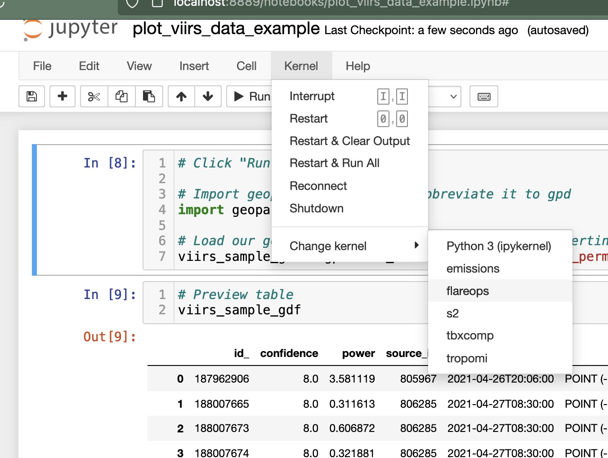
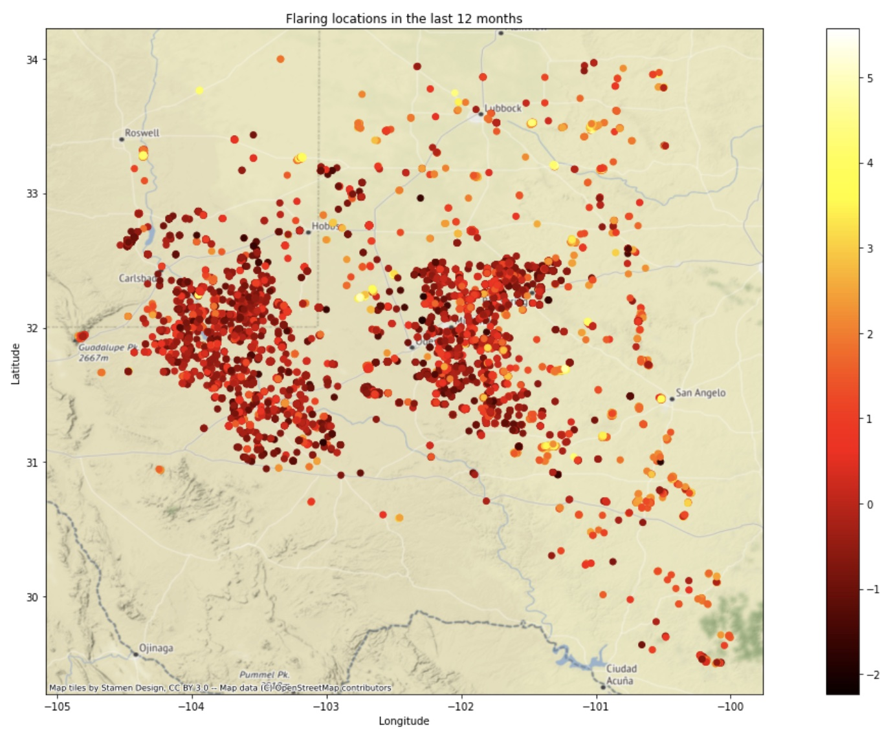
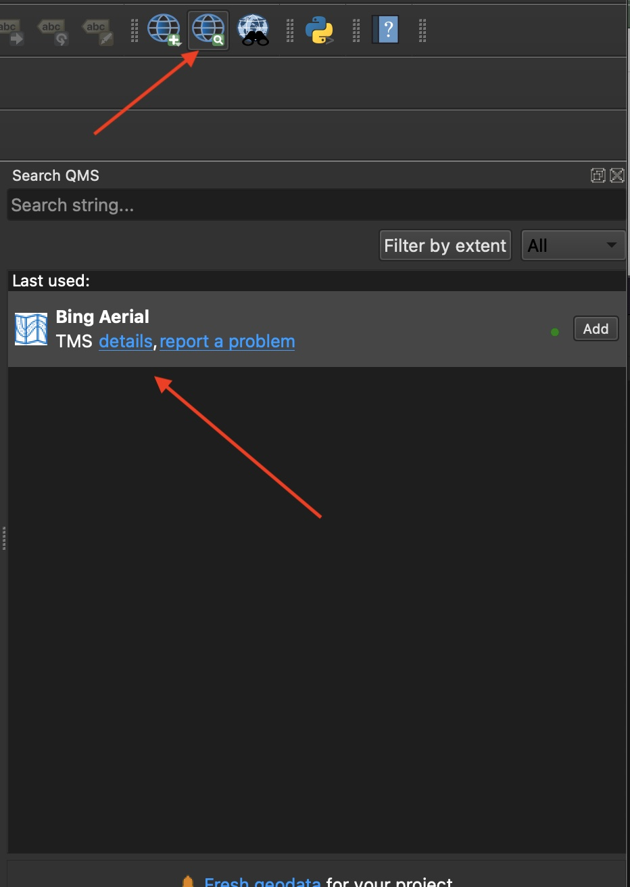
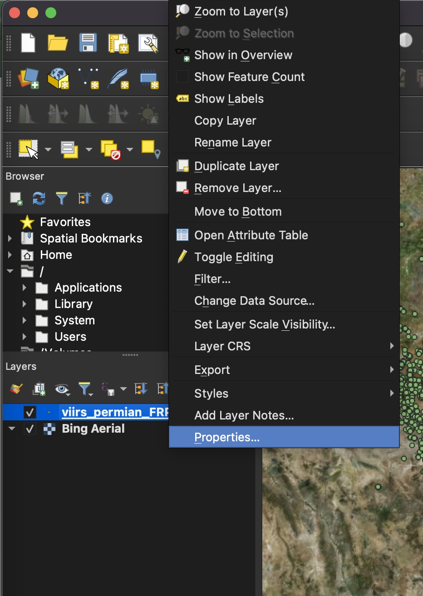
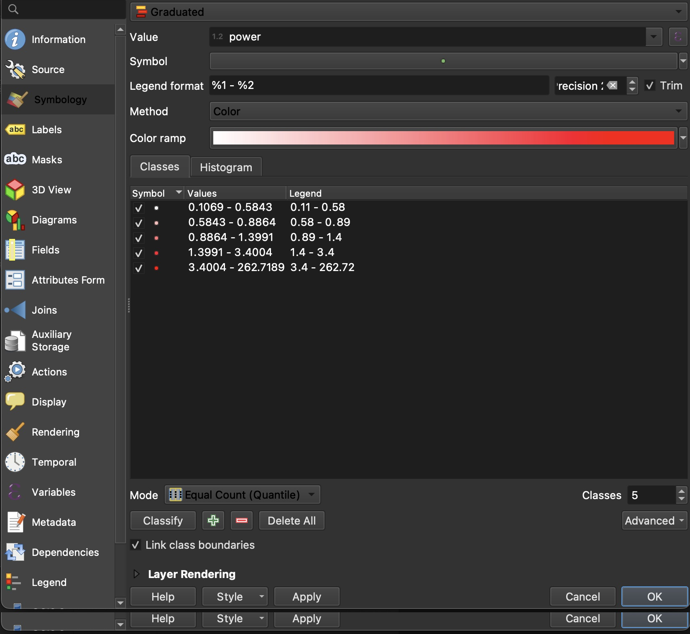
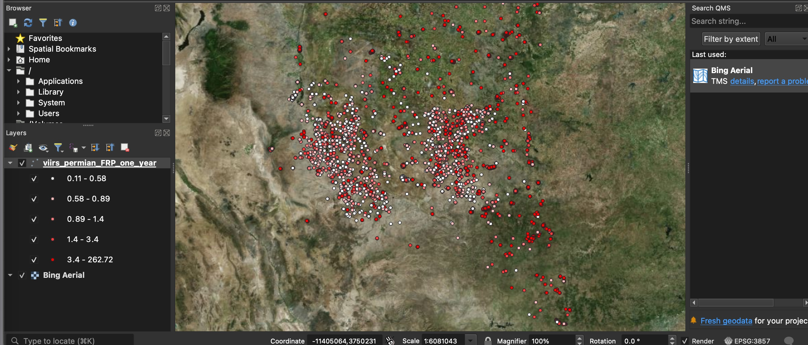

# 🔥🔥 TBX Intern Project: Shihao Z 🔥🔥

## 27.04.2022

### New Data and Documentation

Our goal is to be able to plot flaring time series data along with TBX wellpad discoveries and regulator reported well lifecycle events (permits, spuds, completions). A very active county in the Permian is **Midland** county, and it contains several wellpad sites that have a long history of flaring. By plotting the flaring time series data (daily, weekly, or monthly), along with the discrete life cycle events (as vertical lines or annotations), we can visualise to see how each of these independent datasets compare!

#### Regulator Well Lifecycle Events (Midland County)

Path: `data/well_event_data/midland_county_wellevents.csv`

Schema: `documentation/2021.02.19 Well Events Schema.pdf`

#### Wellpads with observed flaring (Midland County)

Path: `data/flaring_data/wellpads_with_flaring_midland.csv`

Schema: `documentation/2020.12.10 TBXFLARE 🔥 schema documentation.pdf`

### Data exploration

#### 1. Explore and Plot flaring time series

Code snippet example of how to convert time series strings into objects:

```
from datetime import datetime
import pandas as pd

# Example of how to parse time series dat
df_nm_flaring = pd.DataFrame()

for idx, row in nm_flaring_with_data.iterrows():
    
    # Convert strings to objects
    ts_mw = eval(row['ts_flaring_power_MW'])
    ts_gj = eval(row['flaringenergy'])
    
    # Loop through each of the events
    for idx, t in enumerate(ts_mw):
        
        # Parse time
        tmid = datetime.strptime(t['time'], '%Y-%m-%d %H:%M:%S')
        if t['value'] > 0:
            new_row = {
              'id':row.id,
              'lease_name':row.lease_name,
              'flaring_energy_GJ':ts_mw[idx]['value'],
              'flaring_power_MW':t['value'],
              'year':int(tmid.year),
              'month':int(tmid.month),
            }
            df_nm_flaring = df_nm_flaring.append(new_row, ignore_index=True)
```

#### 2. Search well event table and plot relevant regulator events

`wellpad.id == wellevent.wellpads_id`

If data exists for a given pad in the wellpad table, plot/annotate regulator event dates below on the same axis as any flaring time series.

* `tst_first_detection_date`
* `tst_permit_date`
* `tst_spud_date`
* `tst_regulator_completion_date`
* `tst_fracfocus_jobstart_date`
* `tst_fracfocus_jobend_date`

See if you can create a script that will plot both flaring and regulator events on the same axes!

## 26.04.2022
This README contains a basic startup guide to get you up and running with a Python development environment ready to ingest, process and plot geospatial data! 
### 1. Install Anaconda 
* [https://docs.anaconda.com/anaconda/install/index.html](https://docs.anaconda.com/anaconda/install/index.html)
* Open terminal/CLI interface and type `conda info` to confirm install (you might need to restart terminal application)

### 2. Install git and clone this repo
* [https://git-scm.com/book/en/v2/Getting-Started-Installing-Git](https://git-scm.com/book/en/v2/Getting-Started-Installing-Git)
* Clone this repository: `git clone https://github.com/Terrabotics/tbx-flaring-shihao.git`
### * `cd tbx-flaring-shihao`

#### 2.1 Set git config:

`git config user.name "Your Name"`

`git config user.email "your@email"`

### 3. Setup conda environment

#### 3.1 Create and activate `flareops` environment
`conda create --name 'flareops'`

`conda activate flareops`

#### 3.2 Install dependencies

**Install Python 3.9:** `conda install python=3.9`

**Install Jupyterlab:**
`pip3 install jupyterlab`

**Install matplotlib**
`pip3 install matplotlib`

**Install geopandas:**
`pip3 install geopandas`

**Install ipykernel**
`conda install -c anaconda ipykernel`


### 4. Add python kernel to Jupyter

`python3 -m ipykernel install --user --name=flareops`


### 5. Run Jupyter Notebook

`jupyter notebook`

### 6. Run example in `flareops` environment

Click `plot_viirs_data_example.ipynb`

#### Set Kernel


#### Run!
The final plot should look something like this:


### 7. Explore VIIRS FRP geojson data in QGIS

QGIS is a great tool for visualising geospatial data, give it a try!
#### 7.1 Install QGIS
[https://qgis.org/en/site/forusers/download.html](https://qgis.org/en/site/forusers/download.html)

#### 7.2 Load VIIRS FRP geojson

Drag and drop `sample_data/viirs_permian_FRP_one_year.geojson` into QGIS for it to load.

#### 7.3 Add basemap using QuickMapServices plugin

**Install**: Plugins --> Manage and Install Plugins


**Add Bing Aerial**
Double click `Bing Aerial`:


#### 7.4 Change Layer Symbology

Go to layer properties:



Add a graduated symbology based on `power` attribute:



